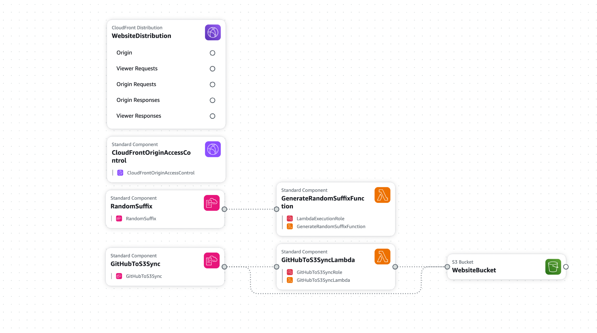

# Static Website Hosting with AWS and GitHub

This project sets up static website hosting on AWS using S3 and CloudFront, with automated deployments from a GitHub repository. 
The infrastructure is defined as code using cloudformation.

## Features

- S3 bucket for storing website files with proper security settings
- CloudFront distribution for global content delivery
- Random bucket name generation for uniqueness
- GitHub integration for automated deployments
- Organized stacks code structure



```bash 
aws cloudformation create-stack
--stack-name static-website-infrastructure
--template-body [file://infrastructure.yaml](#)
--parameters
ParameterKey=BucketNamePrefix,ParameterValue=my-static-website
ParameterKey=PriceClass,ParameterValue=PriceClass_100
--capabilities CAPABILITY_IAM
``` 

Wait for the stack to complete deployment:
```bash 
aws cloudformation wait stack-create-complete --stack-name static-website-infrastructure
``` 

### 2. Deploy the GitHub Sync Stack

Once the infrastructure stack is deployed, we can deploy the GitHub sync stack. This stack uses cross-stack references to access resources created in the infrastructure stack.
```bash 
aws cloudformation create-stack
--stack-name static-website-github-sync
--template-body [file://github-sync.yaml](#)
--parameters
ParameterKey=InfrastructureStackName,ParameterValue=static-website-infrastructure
ParameterKey=DistributionId,ParameterValue=distribution-id
ParameterKey=BucketName,ParameterValue=name-bucket
ParameterKey=GitHubOwner,ParameterValue=your-username
ParameterKey=GitHubRepo,ParameterValue=your-repo
ParameterKey=GitHubBranch,ParameterValue=main
ParameterKey=SyncFrequency,ParameterValue="rate(1 hour)"
--capabilities CAPABILITY_IAM
``` 

### 3. (Optional) Deploy the Custom Domain Stack

If you want to use a custom domain:
```bash 
aws cloudformation create-stack
--stack-name static-website-custom-domain
--template-body [file://custom-domain.yaml](#)
--parameters
ParameterKey=InfrastructureStackName,ParameterValue=static-website-infrastructure
ParameterKey=DomainName,ParameterValue=example.com
ParameterKey=HostedZoneId,ParameterValue=Z1234567890ABCDEFGHI
--capabilities CAPABILITY_IAM
``` 

## Getting Stack Outputs

To view the outputs of the infrastructure stack (including the CloudFront URL):
```bash 
aws cloudformation describe-stacks --stack-name static-website-infrastructure --query "Stacks[0].Outputs"
``` 

## Stack Deletion (in reverse order)

When you're done with the resources, delete the stacks in reverse order:
```bash
# Delete custom domain stack (if deployed)
aws cloudformation delete-stack --stack-name static-website-custom-domain
# Delete GitHub sync stack
aws cloudformation delete-stack --stack-name static-website-github-sync
# Delete objects bucket.
aws s3 rm s3://my-static-website --recursive
# Delete infrastructure stack
aws cloudformation delete-stack --stack-name static-website-infrastructure
``` 

## How Cross-Stack References Work

This solution uses CloudFormation's cross-stack references to share information between stacks [[1]](https://docs.aws.amazon.com/AWSCloudFormation/latest/UserGuide/walkthrough-crossstackref.html):

1. The infrastructure stack exports key resources using the `Export` property in its `Outputs` section
2. The GitHub sync stack imports these values using `Fn::ImportValue`

This approach follows AWS best practices for creating modular and reusable CloudFormation templates [[2]](https://docs.aws.amazon.com/AWSCloudFormation/latest/UserGuide/best-practices.html).

## Key Features

- **Automated Content Updates**: Content is automatically synced from GitHub to S3
- **CloudFront Distribution**: Fast content delivery with edge caching
- **Modular Architecture**: Separate stacks for infrastructure and automation
- **Scheduled Updates**: Periodic sync from GitHub (configurable frequency)
- **Custom Domain Support**: Optional integration with Route 53 and ACM

## Customization Options

- **Custom Error Pages**: Edit the CloudFront configuration in infrastructure.yaml
- **Cache Behavior**: Modify the CloudFront cache settings as needed
- **Sync Frequency**: Adjust the sync schedule in the GitHub sync stack
- **Content Types**: Add additional MIME types in the GitHub sync Lambda function

## Troubleshooting

If you encounter the error `An error occurred (ValidationError) when calling the CreateStack operation: Template format error: Unresolved resource dependencies`, make sure the infrastructure stack has completed deployment and exported its outputs before deploying dependent stacks.

## Security Considerations

- All S3 buckets are configured with public access blocked
- CloudFront uses Origin Access Control for secure S3 access
- IAM roles follow the principle of least privilege
- No credentials are stored in the templates

## Advanced Use Cases

For production environments, consider these enhancements:

1. **CDN Optimization**: Adjust the CloudFront cache behaviors for your specific content
2. **Multiple Environments**: Deploy separate stacks for development, staging, and production
3. **CI/CD Integration**: Replace the GitHub sync with AWS CodePipeline for more robust CI/CD

## Limitations

- This solution doesn't handle private GitHub repositories (would require GitHub credentials)
- Cross-stack references cannot span AWS regions [[3]](https://repost.aws/questions/QUzKBSX3VASvqyY1GvLmVqvA/cloud-formation-cross-region-stack-reference)
- Manual invalidation might be needed if CloudFront caching is aggressive

## License

This project is licensed under the MIT License - see the LICENSE file for details.
```
