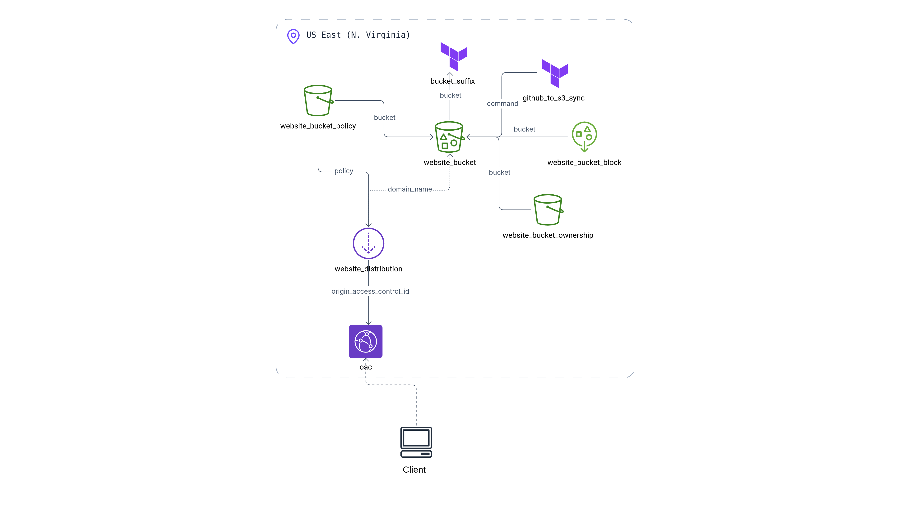

# Static Website Hosting with AWS, Terraform, and GitHub

This project sets up static website hosting on AWS using S3 and CloudFront, with automated deployments from a GitHub repository. The infrastructure is defined as code using Terraform.

## Features

- S3 bucket for storing website files with proper security settings
- CloudFront distribution for global content delivery
- Random bucket name generation for uniqueness
- GitHub integration for automated deployments
- Organized Terraform code structure
  


## Project Structure

```
.
├── main.tf                   # Core infrastructure (S3 bucket, providers)
├── cloudfront.tf             # CloudFront distribution configuration
├── github_integration.tf     # GitHub to S3 sync setup
├── random.tf                 # Random resource generation
├── variables.tf              # Input variable definitions
├── outputs.tf                # Output values
├── terraform.tfvars.example  # Example variable values
└── README.md                 # Project documentation
```

## Prerequisites

- [Terraform](https://www.terraform.io/downloads.html) (v1.2.0+)
- AWS CLI configured with appropriate credentials
- Git (if using the null_resource approach for GitHub integration)

## Setup Instructions

1. Clone this repository
2. Copy `terraform.tfvars.example` to `terraform.tfvars` and customize the values
3. Initialize Terraform:
```
terraform init
```

4. Preview changes:
```
terraform plan
```

5. Apply the configuration:
```
terraform apply
```


## Important Configuration Notes

### GitHub Integration Options

The current implementation uses a `null_resource` with local commands to sync GitHub content to S3. For production environments, consider:

1. **AWS CodePipeline/CodeBuild** (recommended for production)
   - Fully managed CI/CD pipeline
   - Automatic deployments on repository changes
   - Proper audit trail and security

2. **GitHub Actions**
   - Define workflows directly in your repository
   - Use AWS credentials via GitHub secrets

3. **Current Approach (`null_resource`)**
   - Simple but requires Git and AWS CLI on the Terraform machine
   - Runs on every `terraform apply`
   - Good for development/testing

### S3 Bucket Naming

The configuration generates a random suffix for the S3 bucket name to ensure global uniqueness. You only need to specify the prefix in `terraform.tfvars`.

### CloudFront Settings

The default configuration provides basic settings. You can customize:
- Price class (determines geographic coverage)
- Cache TTL values
- Compression settings
- Custom domain and SSL certificate (requires additional configuration)

## Customization

Edit the `terraform.tfvars` file to configure:

```
aws_region          = "us-east-1"       # AWS region to deploy in
bucket_name_prefix  = "my-website"      # Will be combined with random suffix
github_repo_url     = "https://github.com/your-username/your-repo.git"
github_repo_path    = "dist"            # Path within repository containing website files
cloudfront_price_class = "PriceClass_100" # Geographic coverage
```

## Delete stack

1. **Initialize Terraform (if needed):**
```
terraform init
```

2. **Review what will be destroyed:**
```
terraform plan -destroy
```

3. **Delete the stack:**
```
terraform destroy
```
4. **Verify deletion** - After the destroy operation completes, verify in the AWS Console that the resources have been deleted:
   - S3 bucket
   - CloudFront distribution
   - Any other resources created by your Terraform configuration

For non-empty S3 buckets, you can force empty them with:
```
aws s3 rm s3://your-bucket-name --recursive
```
Then try running `terraform destroy` again.


## Advanced Usage

### Adding a Custom Domain

To use a custom domain with your CloudFront distribution, you'll need to:

1. Add Route 53 zone and record configurations
2. Create an ACM certificate for your domain
3. Update the CloudFront configuration to use the custom domain and certificate

### Implementing CI/CD with AWS CodePipeline

The repository includes an alternative implementation using AWS CodePipeline for production environments. To use it:

1. Replace `github_integration.tf` with `github_integration_with_codepipeline.tf`
2. Add the required variables to `terraform.tfvars`
3. Follow the AWS CodeStar connection setup process

## Troubleshooting

- **S3 Permission Issues**: Check your AWS credentials and S3 bucket policy
- **CloudFront Errors**: Verify origin settings and cache behaviors
- **GitHub Integration Failures**: Ensure Git is installed and the repository URL is correct

## Security Considerations

- The S3 bucket is configured to block all public access
- CloudFront uses Origin Access Control for secure S3 access
- Consider adding WAF for additional security at the CloudFront level
- Use AWS IAM roles and least privilege principles for CI/CD integrations

## License

[MIT License](LICENSE)